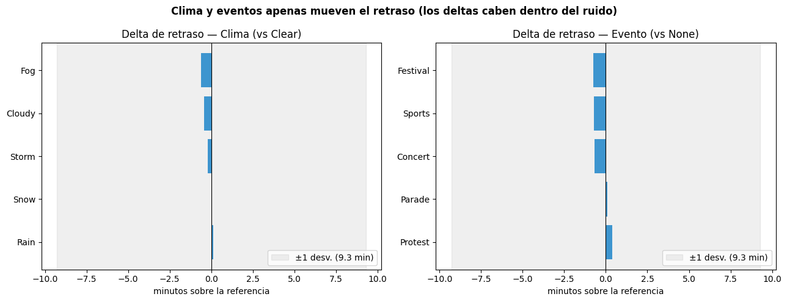

# Public Transport Delays Prediction

> Predecir retrasos de transporte con clima y eventos — y un hallazgo honesto sobre los datos.
> Pipeline de regresión reproducible + análisis crítico de la señal predictiva.

[](https://github.com/0marMF/transport-delays/actions/workflows/ci.yml)
[](https://python.org)
[](https://xgboost.readthedocs.io)
[](https://scikit-learn.org)

---

## Objetivo

Predecir el **retraso de llegada (minutos)** del transporte público a partir de clima, eventos y
variables temporales (2,000 viajes), y —sobre todo— evaluar **cuánta señal predictiva** ofrecen
realmente esas variables.

---

## Resultados (regresión, validación cruzada 5-fold + test)

| Modelo | MAE (min) | RMSE (min) | R² |
|---|---|---|---|
| **DummyRegressor (predice la media)** | **7.70** | 9.19 | −0.00 |
| Linear Regression | 7.73 | 9.25 | −0.02 |
| Random Forest | 7.76 | 9.25 | −0.02 |
| XGBoost | 7.88 | 9.41 | −0.05 |

> **Hallazgo central (honesto):** **ningún modelo le gana al baseline** que solo predice la media.
> El R² es ≈ 0 (o negativo) en todos. Las features disponibles (clima/eventos de este dataset
> sintético) **no explican** el retraso. Que un modelo lineal empate con XGBoost —y que ambos
> empaten con predecir la media— confirma que **el problema es la señal de los datos, no el
> algoritmo**. Ningún modelo rescata features sin información.

---

## Interpretación descriptiva (clima y eventos)

Como el modelo no predice, la pregunta declarada del proyecto —*cómo afectan clima y eventos*— se
responde de forma descriptiva (`python -m src.report` → [`reports/insights.md`](reports/insights.md)):

- **Por clima:** la mayor diferencia es **0.62 min** (Fog vs Clear) — y encima con signo absurdo
  (la niebla *reduce* el retraso). Frente a una desviación de **9.3 min**, es ruido.
- **Por evento:** la mayor diferencia es **0.76 min**; conciertos y festivales aparecen con *menos*
  retraso que un día sin evento. También ruido.
- **¿Y como clasificación** ("retraso severo sí/no")? AUC ≈ **0.5** en todos los umbrales —
  indistinguible de tirar una moneda.



> Conclusión honesta: clima y eventos de este dataset no explican el retraso, ni para predecir ni
> para describir. La recomendación operativa es planificar con el promedio (~13 min) y conseguir
> datos con señal real (GPS/AVL, ocupación, incidencias) para un modelo útil.

---

## Metodología

El pipeline reproducible vive en `src/` y corre de una sola vez:

```bash
python -m src.pipeline      # datos -> features -> baseline + 3 modelos -> metrics.json + modelo
python -m src.validate      # chequea el contrato de datos (rangos, categorías, nulos esperados)
python -m src.report        # reporte descriptivo clima/eventos -> reports/insights.{json,md} + figura
```

Antes de entrenar, el pipeline aplica un **contrato de datos** (rangos, categorías y nulos
esperados) y un **guard anti-leakage** que falla si `delayed` —el target binarizado— intenta
colarse como feature. El objetivo: que el error de leakage sea **imposible de repetir**.

Los notebooks cuentan la narrativa y se apoyan en `src/`:

1. **EDA** (`01_EDA.ipynb`) — distribución del retraso, impacto de clima y eventos, patrones
   temporales, correlaciones.
2. **Preprocessing** (`02_preprocessing.ipynb`) — imputación de `event_type`, feature engineering
   (`has_event`, `extreme_weather`), One-Hot encoding, escalado. **Se excluye `delayed`** porque es
   el target binarizado (*data leakage*).
3. **Modelado** (`03_modeling.ipynb`) — DummyRegressor (baseline), Linear Regression, Random Forest
   y XGBoost con **validación cruzada 5-fold** (dataset pequeño), métricas MAE/RMSE/R² y análisis.

---

## Lecciones del proyecto

- **Un baseline cambia la lectura:** sin el DummyRegressor, un R² ≈ 0 es ambiguo; con él queda
  claro que los modelos no aportan nada sobre predecir la media.
- **Detectar y evitar *data leakage*:** `delayed` correlaciona 0.76 con el target porque *es* el
  target binarizado — incluirlo habría inflado falsamente el rendimiento.
- **Un R² bajo bien diagnosticado vale más que un número inflado:** el valor del análisis está en
  demostrar, con validación cruzada, que las features no tienen señal.
- **Dataset pequeño (2,000) → validación cruzada** obligatoria para no confiar en un único split.

---

## Servir el modelo (con honestidad)

El modelo se sirve igual que en los demás proyectos del portafolio, como demostración de serving —
no porque sea fiable. **Con R² ≈ 0 devuelve algo cercano al promedio histórico (~13 min) casi sin
importar el input;** por eso tanto el CLI como la API lo dicen explícitamente.

```bash
python -m src.score --weather Storm --event Sports --departure-delay 10   # CLI
uvicorn src.api:app --reload                                              # API: POST /predict (docs en /docs)
```

> No usar para decisiones a nivel de viaje. Detalle de supuestos y límites en `MODEL_CARD.md`.

---

## Estructura

```
transport-delays/
├── config.yaml                   # rutas, target, columnas a escalar/excluir, hiperparámetros
├── data/                         # dataset (no versionado) + splits.pkl
├── src/                          # config, data, features, model, validate, report, score, api, pipeline
│   └── best_model.pkl            # modelo + scaler serializados
├── notebooks/                    # 01_EDA, 02_preprocessing, 03_modeling (importan src/)
├── reports/                      # visualizaciones + metrics.json + experiments.csv + insights.{json,md}
├── MODEL_CARD.md                 # supuestos, evaluación y por qué NO usar el modelo para decisiones
├── HALLAZGOS.md   README.md   ROADMAP.md
```

---

## Cómo ejecutar

```bash
pip install -r requirements.txt

# Pipeline completo de una vez (datos -> baseline + modelos -> métricas + modelo servible)
python -m src.pipeline

# O los notebooks (narrativa) en orden
jupyter nbconvert --to notebook --execute --inplace notebooks/01_EDA.ipynb
jupyter nbconvert --to notebook --execute --inplace notebooks/02_preprocessing.ipynb
jupyter nbconvert --to notebook --execute --inplace notebooks/03_modeling.ipynb
```

```bash
# Tests (datos sintéticos + modelo versionado; no necesitan el dataset)
pip install -r requirements-dev.txt
pytest
```

> Dataset: [Public Transport Delays with Weather and Events — Kaggle](https://www.kaggle.com/datasets/khushikyad001/public-transport-delays-with-weather-and-events)
> (colócalo en `data/`; no se versiona).

> Detalle de detecciones y aprendizajes en [`HALLAZGOS.md`](HALLAZGOS.md).
> Supuestos, evaluación y por qué NO usar el modelo para decisiones en [`MODEL_CARD.md`](MODEL_CARD.md).

---

## Autor

**Omar Mora Flores** · Data Analyst & ML Engineer
omar13mor@gmail.com · [linkedin.com/in/omar-mora-flores](https://linkedin.com/in/omar-mora-flores)
